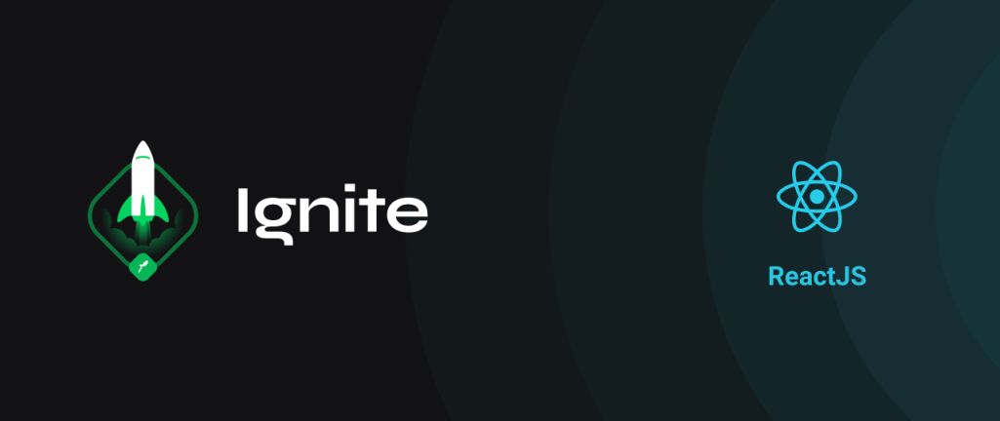
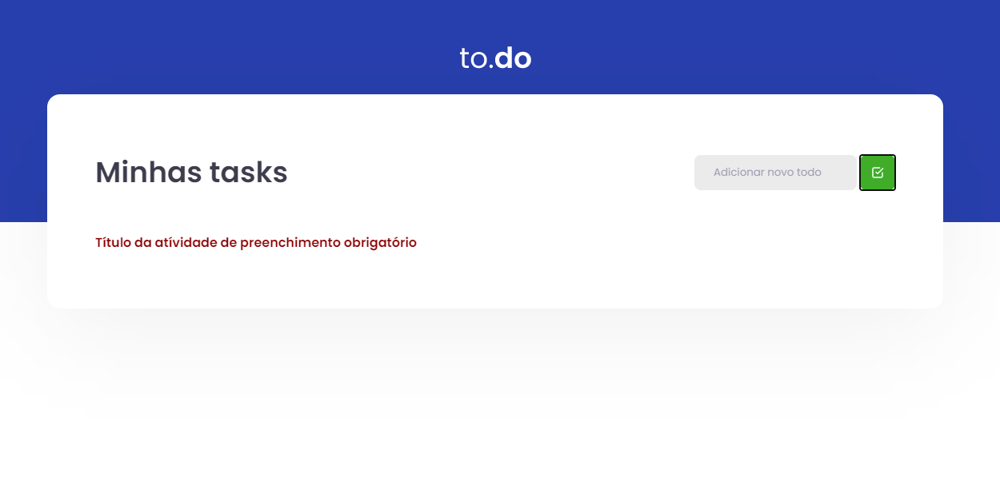
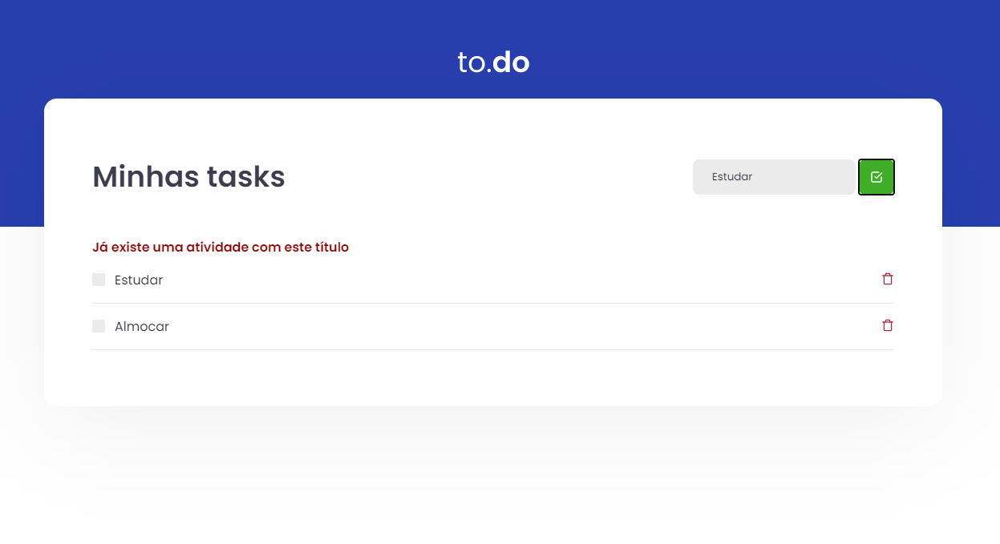

  

  # Ignite Rocketseat Desafio 01.
  Trata-se de uma aplicação simples Onde podemos cadastrar atividades a serem executadas, excluir atividades e também finalizá-las

  
  
  
  

 

## Algumas funcionalidades incluídas:

- **Erro de validação para envio de formulário em branco** — É exibido um erro na tela quando o usuário tenta cadastrar uma atividade sem informar um título
- **Erro de validação de atividade duplicada** — O sistema verifica o título digitado e caso já exista uma atividade com aquele título um erro é mostrado em tela

## Iniciando

1. Clone este  reposítório usando `git clone https://github.com/maykonsousa/IgniteReactchallenge01`
2. acesse a pasta do projeto via terminal com o comando: `cd IgniteReactchallenge01` 
3. Utilize o comando  `yarn` ou `npm install `para instalar todas as dependências necessárias 
4. Utilize o comando  `yarn dev` para iniciar a aplicação;
5. Abra o seu browser e acesse a url `localhost:8080`

## Preview

  

  

***

## CONTATOS
**website**:[http://maykonsousa.github.io](http://maykonsousa.github.io/)  
**LinkedIn**: [https://www.linkedin.com/in/maykonsousa](https://www.linkedin.com/in/maykonsousa/)  
**Whatsapp**: 61 992943297